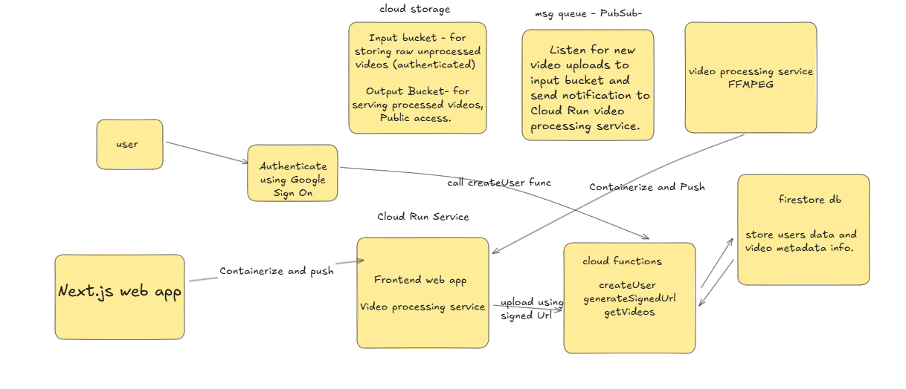

# Videomash

Videomash is a YouTube clone that allows users to upload, process, and watch videos. The project is designed with a scalable, event-driven microservices architecture hosted on Google Cloud Platform (GCP).

## Features

- **User Authentication**: Secure user sign-in and sign-out using Google Authentication.
- **Video Upload**: Authenticated users can upload raw video files to a dedicated Cloud Storage bucket.
- **Automatic Video Processing**: An event-driven workflow automatically triggers a video processing service whenever a new video is uploaded.
- **Scalable Processing**: The video processing service, containerized and deployed on Cloud Run, converts videos to a more web-friendly format (360p) using `ffmpeg`.
- **Video Hosting and Streaming**: Processed videos are stored in a public Cloud Storage bucket, enabling fast and efficient streaming on the web client.
- **Video Gallery**: The web client fetches and displays a gallery of processed videos for users to watch.

## Technical Details

The project is structured into three main services to ensure high availability, scalability, and maintainability.

### 1. Web Client (Frontend)

- **Technology**: Built using **Next.js**, a React framework for building fast and scalable web applications.
- **Functionality**:
  - Handles user authentication and display logic.
  - Allows users to upload video files, which are sent to a pre-signed URL generated by the `yt-api-service`.
  - Displays a list of available videos and plays them using an HTML5 `<video>` player, fetching the processed video from Cloud Storage.

### 2. YouTube API Service (Cloud Functions)

- **Technology**: Implemented with **Firebase Cloud Functions** and **Firebase Admin SDK**.
- **Functionality**:
  - `createUser`: Triggered upon new user sign-up via Google Authentication. It stores user information in **Cloud Firestore**.
  - `generateUploadUrl`: A callable function that generates a signed URL for a client to securely upload a video directly to a Cloud Storage bucket.
  - `getVideos`: A callable function that retrieves a list of video metadata (e.g., ID, title, status) from Firestore to be displayed on the client.

### 3. Video Processing Service (Cloud Run)

- **Technology**: A lightweight **Node.js** service running within a Docker container on **Cloud Run**.
- **Functionality**:
  - Subscribes to Pub/Sub events triggered by new video uploads to the raw video bucket.
  - Downloads the raw video file.
  - Uses the `fluent-ffmpeg` library to convert the video to 360p resolution.
  - Uploads the new, processed video to a separate public Cloud Storage bucket.
  - Deletes the raw and processed video files from local storage to conserve disk space.
  - Updates the video's status in the Cloud Firestore database to 'processed'.

## System Design

##### Demo
https://youtu.be/7TVAZLHtsDA
